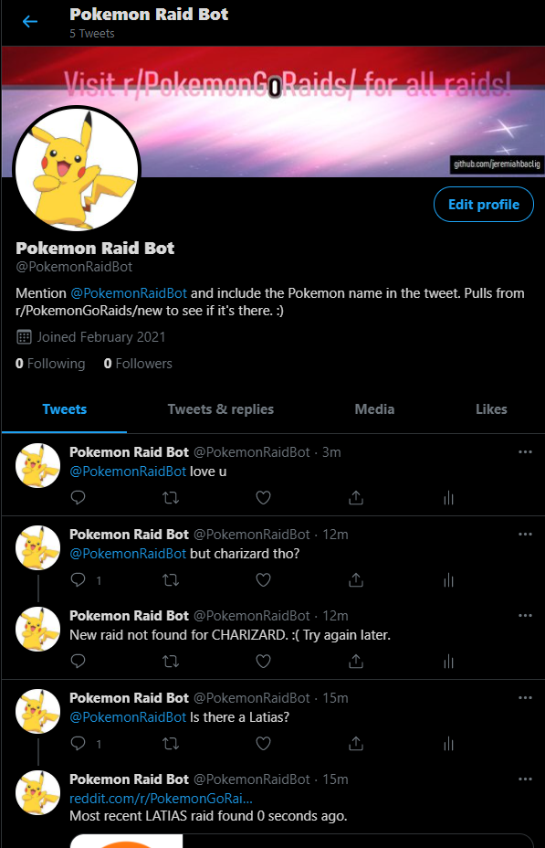

# Twitter-Bot
Script pulls from *Reddit API* to parse through r/PokemonGoRaids and utilizes the *Twitter API* to post. It looks through the subreddit given the parameters of the last 10 **new** posts and the Pokemon name. Prior to receiving the name, it passes it through the directory of all possible Pokemon from ```https://gist.github.com/simsketch/1a029a8d7fca1e4c142cbfd043a68f19```
to verify it, posts a reply to the mentioned post.



For future updates (TO-DO):
- [ ] Additional error handling for more situations.
- [ ] Add option for multiple Pokemon input.
- [ ] Add more commands such as: 
  * Most recent raid
  * Last time a Pokemon raid was spotted for a specific name
  * The last x Pokemon spotted
  * Friend code of poster
- [ ] Run on server instead of local machine for 24/7 access.
- [ ] Store tweet ID's in DB to exclude tweets when re-running.

**Twitter API:**
https://developer.twitter.com/en/docs

**Reddit API:**
https://www.reddit.com/dev/api/
